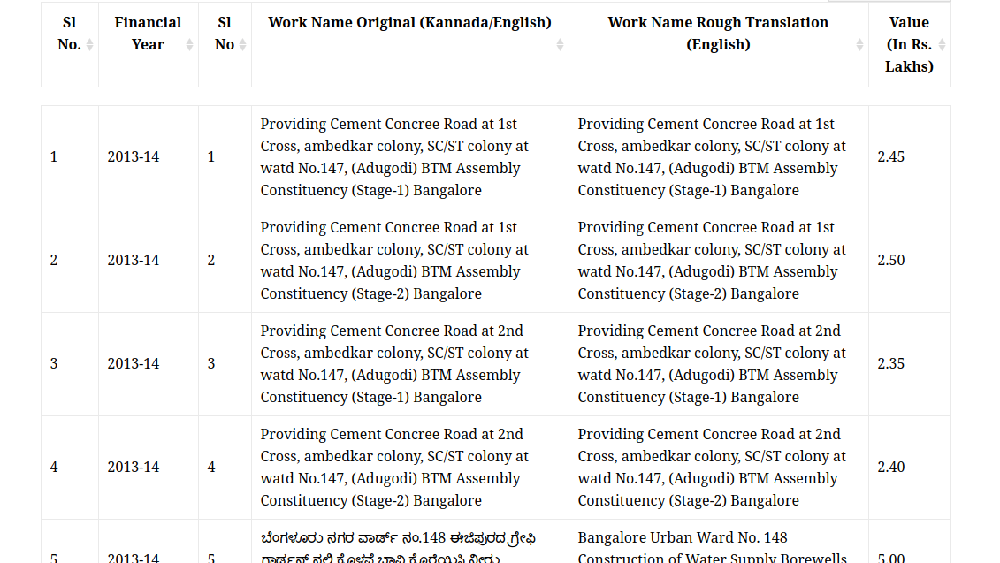

### Possible Problem Statements
- Figuring out which constituency we belong to - Data
- Details of the current MLA - Data
- Contesting candidates for an constituency - Data
- Has the present MLA contested in the earlier elections. If so, what were their developmental initiatives - Data, Complicated
- Stage debates for new candidates (Newspaper, social medias)
- Party affiliations of the candidates - Data
- Party manifesto - Data; Promised vs Achieved - Data
- A platform to raise our opinions / demands - 
- Efficiency of the MLA - Data
- Portal to get details of the election registration and voting process
- Candidates criminal cases / personal manifesto for the constituency  
- List of community engagements - Data, Complicated
- How many questions raised by the MLA in the assembly? - Data
- Social media engagement - Data
- Promised vs Achieved 
- Infrastructure 
- Garbage Disposal
- Water Scarcity

## Problem Statement:

We want to use the MLA LAD fund data to understand the development work done by the current MLA in our constituency.

#### Data Sources:

http://opencity.in/tag/lad-funds
http://kllads.kar.nic.in/MLAWise_reports.aspx

#### What kind of data we have?
- CSV format from OpenCity
--  Financial Year
--  Work name in Kannada/English
--  Money allocated
- Any data extraction/scripting work needed ? - Yes for sector segregation

#### Things to do
We pick  a common constituency for analysis under different heads:

#### What’s the output we’d like to have?
- Category of problems and funds allocated for each of it. - OpenCity
- Least and Most focused area - OpenCity
- Year Wise allocation - OpenCity
- Geo-mapping of the LAD - OpenCity
- Status of the projects - ?

#### Structure of the dataset
                      

